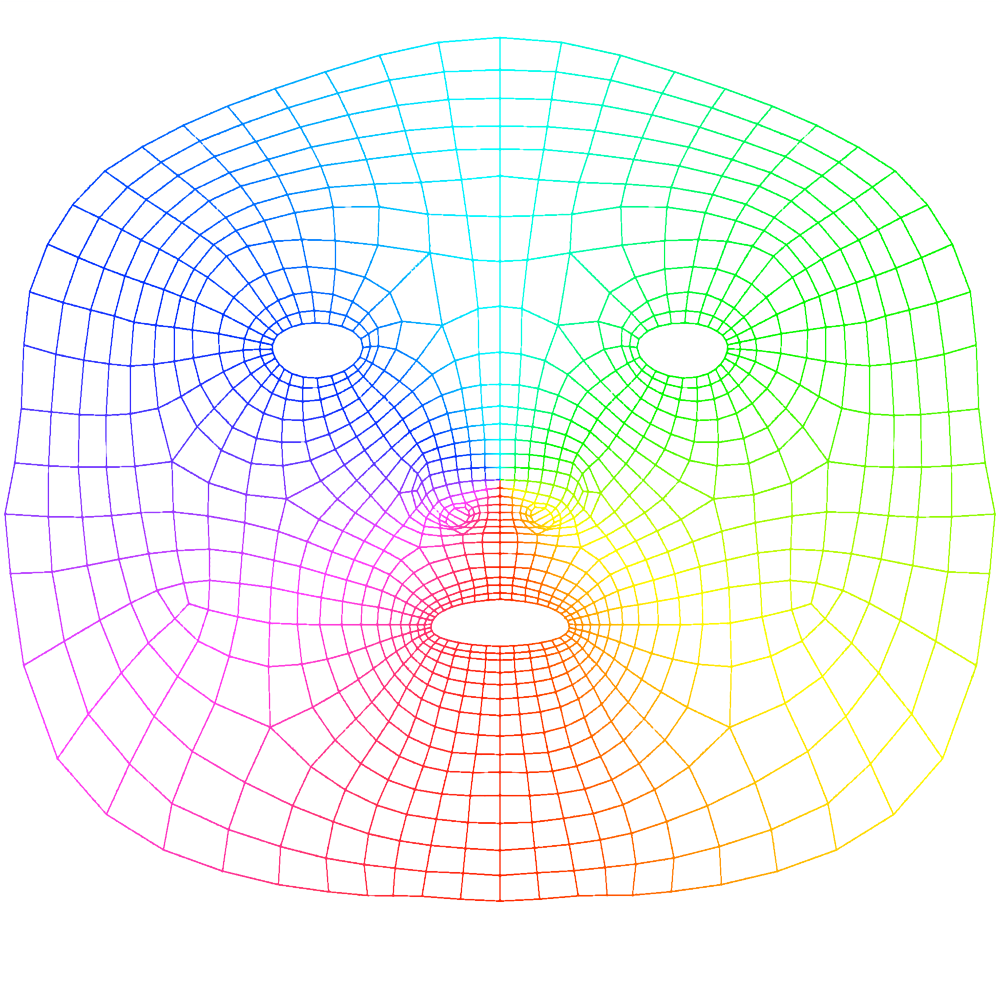

# AR Lipstick

ARKit/Vision based virtual lipstick.

## ARKit

Mainly based on Apple’s sample code [Tracking and Visualizing Faces](https://developer.apple.com/documentation/arkit/tracking_and_visualizing_faces).
Support for multiple faces is not yet verified, but it should work.

I modified the original wireframe to only mask where the lips are, but it’s not very precise.
Here’s the original file for you to make your own, probably more precise mask:

## Vision

Vision framework is capable of generating a low quality outline for lips,
so it is used when the device does not support ARKit.
See [VNFaceLandmarks2D](https://developer.apple.com/documentation/vision/vnfacelandmarks2d) for details.

## Acknowledgements

List of lipstick colors (and their names/brands in Chinese) are from [Ovilia/lipstick](https://github.com/Ovilia/lipstick).

I never figure out how and if [grizzly3ear/lipster-mobile](https://github.com/grizzly3ear/lipster-mobile) works, but it does point me to Vision.framework.
