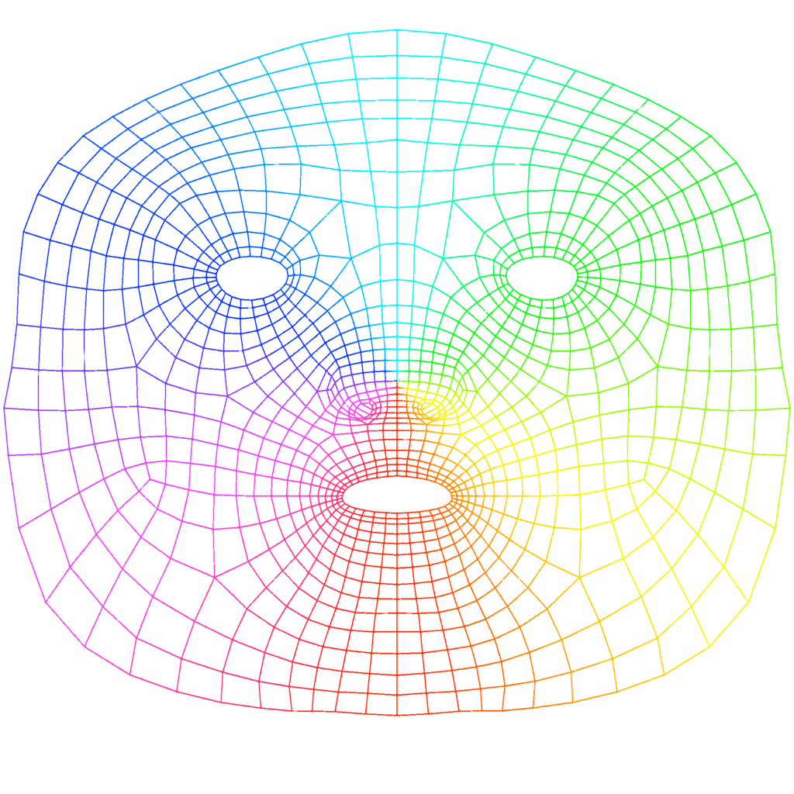

# AR Lipstick

ARKit/Vision based virtual lipstick.

## ARKit

Requires iPhone X/XR/XS/XS Max, iPad Pro (11-inch), iPad Pro (12.9-inch, 3rd generation), or other iOS devices with front-facing TrueDepth camera running iOS 11.0 or later.

Mainly based on Apple’s sample code [Tracking and Visualizing Faces](https://developer.apple.com/documentation/arkit/tracking_and_visualizing_faces).
Support for multiple faces is not yet verified, but it should work (I hope).

I modified the original wireframe to 
only mask where the lips are, 
but it’s not very precise.
Here’s the preview of the 
[original file](.github/wireframeTexture.png)
for you to make your own, 
probably more precise mask:

## Vision

Vision framework is capable of generating 
a ***LOW QUALITY*** outline for lips,
so it is used when the device 
does not meet the ARKit requirements.
See [VNFaceLandmarks2D](https://developer.apple.com/documentation/vision/vnfacelandmarks2d) for details.

## Acknowledgements

List of lipstick colors (and their names/brands in Chinese) are from [Ovilia/lipstick](https://github.com/Ovilia/lipstick).

I never figured out how and if [grizzly3ear/lipster-mobile](https://github.com/grizzly3ear/lipster-mobile) works, but it does point me to Vision.framework.
