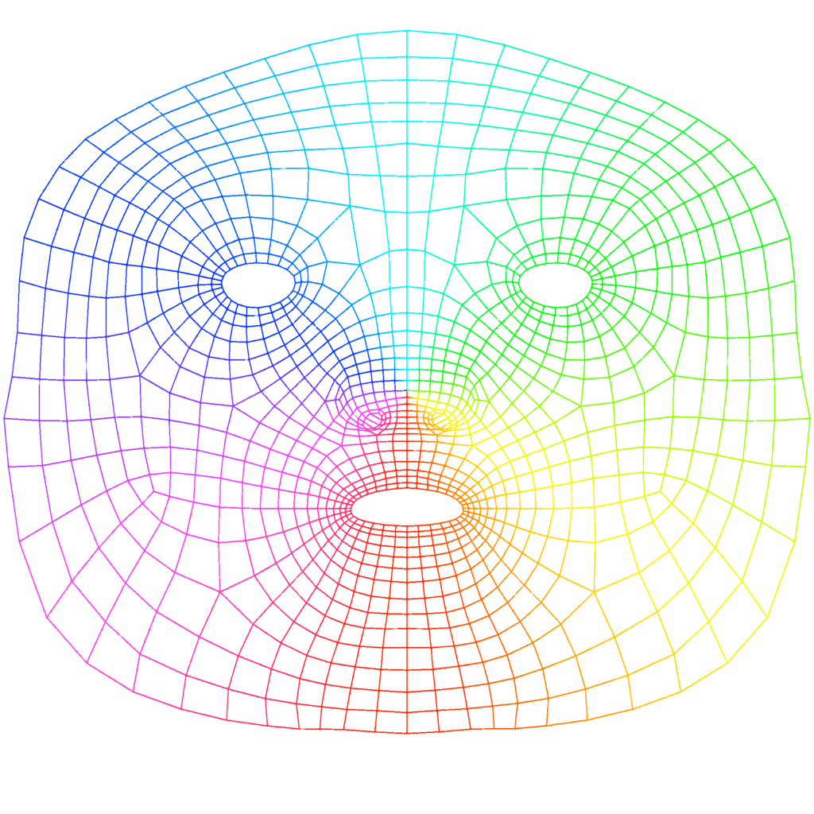

# AR Lipstick

## [Download beta on TestFlight](https://testflight.apple.com/join/IL5MiSG6)

ARKit/MLKit Face Detection based virtual lipstick.

## ARKit

Requires iPhone X/XR/XS/XS Max, iPad Pro (11-inch), iPad Pro (12.9-inch, 3rd generation), or other iOS devices with front-facing TrueDepth camera running iOS 11.0 or later.

Mainly based on Apple’s sample code [Tracking and Visualizing Faces](https://developer.apple.com/documentation/arkit/tracking_and_visualizing_faces).
Support for multiple faces is not yet verified, but it should work (I hope).

I modified the original wireframe to only mask where the lips are, but it’s not very precise.
Here’s the **preview** of the [full size wireframe texture](assets/wireframeTexture.png) for you to make your own,
probably more precise mask:

## MLKit Face Detection

For other devices not having ARKit face detector, we'll use MLKit to trace facial contours, like this:

I highly recommend checking out the [official documentation](https://developers.google.com/ml-kit/vision/face-detection) for more instructions.

### Vision

I tried the Apple provided Vision.framekwork, but it can only generate a ***LOW QUALITY*** outline for lips.
It's not suitable for the purpose of this app, but if you are interested in using it for some other features,
see [VNFaceLandmarks2D](https://developer.apple.com/documentation/vision/vnfacelandmarks2d) for details.

## Acknowledgements

List of lipstick colors (and their names/brands in Chinese) are from [Ovilia/lipstick](https://github.com/Ovilia/lipstick).

I never figured out how and if [grizzly3ear/lipster-mobile](https://github.com/grizzly3ear/lipster-mobile) works,
but it does point me to Vision.framework and FirebaseMLVision (predecessor of MLKit Face Detection).
